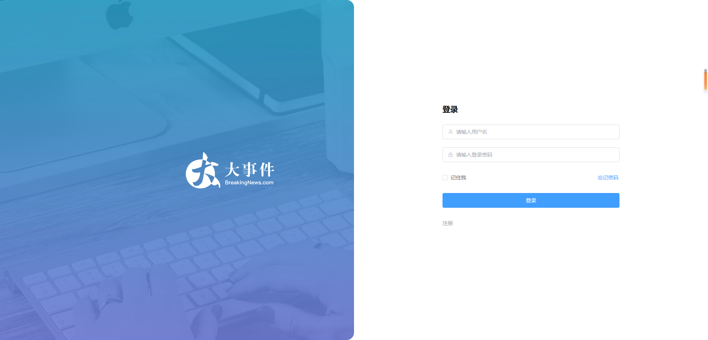
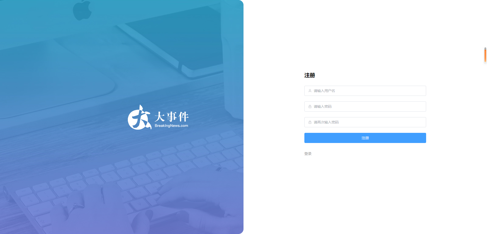

# vue3 的一套文章管理后台系统

## 主要技术栈的文档

- https://element-plus.org/zh-CN/guide/installation.html
- https://pinia.vuejs.org/zh/api/modules/pinia.html#definestore
- https://cn.vitejs.dev/guide/assets.html#new-url-url-import-meta-url

## 系统的接口文档地址

https://apifox.com/apidoc/shared-26c67aee-0233-4d23-aab7-08448fdf95ff/ap1-93850835

## 接口根路径:

https://big-event-vue-api-t.itheima.net

## 参考网站

https://fe-bigevent-web.itheima.net/login

## 效果预览





```
adminsysvue3
├─ .git
│  ├─ config
│  ├─ description
│  ├─ HEAD
│  ├─ hooks
│  │  ├─ applypatch-msg.sample
│  │  ├─ commit-msg.sample
│  │  ├─ fsmonitor-watchman.sample
│  │  ├─ post-update.sample
│  │  ├─ pre-applypatch.sample
│  │  ├─ pre-commit.sample
│  │  ├─ pre-merge-commit.sample
│  │  ├─ pre-push.sample
│  │  ├─ pre-rebase.sample
│  │  ├─ pre-receive.sample
│  │  ├─ prepare-commit-msg.sample
│  │  ├─ push-to-checkout.sample
│  │  └─ update.sample
│  ├─ index
│  ├─ info
│  │  └─ exclude
│  ├─ objects
│  │  ├─ info
│  │  └─ pack
│  │     ├─ pack-44dd5b932df8301180ca9fa78e67cde3d93b13a5.idx
│  │     └─ pack-44dd5b932df8301180ca9fa78e67cde3d93b13a5.pack
│  ├─ packed-refs
│  └─ refs
│     ├─ heads
│     │  └─ master
│     ├─ remotes
│     │  └─ origin
│     │     └─ HEAD
│     └─ tags
├─ .gitignore
├─ index.html
├─ package.json
├─ pnpm-lock.yaml
├─ public
│  └─ vite.svg
├─ README.md
├─ src
│  ├─ api
│  │  └─ index.js
│  ├─ App.vue
│  ├─ assets
│  │  ├─ images
│  │  │  ├─ login_bg.jpg
│  │  │  └─ logo2.png
│  │  └─ vue.svg
│  ├─ layout
│  │  └─ index.vue
│  ├─ main.js
│  ├─ router
│  │  ├─ index.js
│  │  └─ persmisson.js
│  ├─ store
│  │  ├─ index.js
│  │  └─ modules
│  │     ├─ counter.js
│  │     ├─ index.js
│  │     └─ user.js
│  ├─ style.css
│  ├─ utils
│  │  └─ require.js
│  └─ views
│     ├─ About.vue
│     ├─ article
│     │  ├─ ArticleChannel.vue
│     │  └─ ArticleManage.vue
│     ├─ Home.vue
│     ├─ login
│     │  └─ loginPage.vue
│     └─ user
│        ├─ UserAvatar.vue
│        ├─ UserPassword.vue
│        └─ UserProfile.vue
├─ vite.config.js
└─ vite.config.js.timestamp-1713147247032-eb83f6b7a12ac.mjs

```
